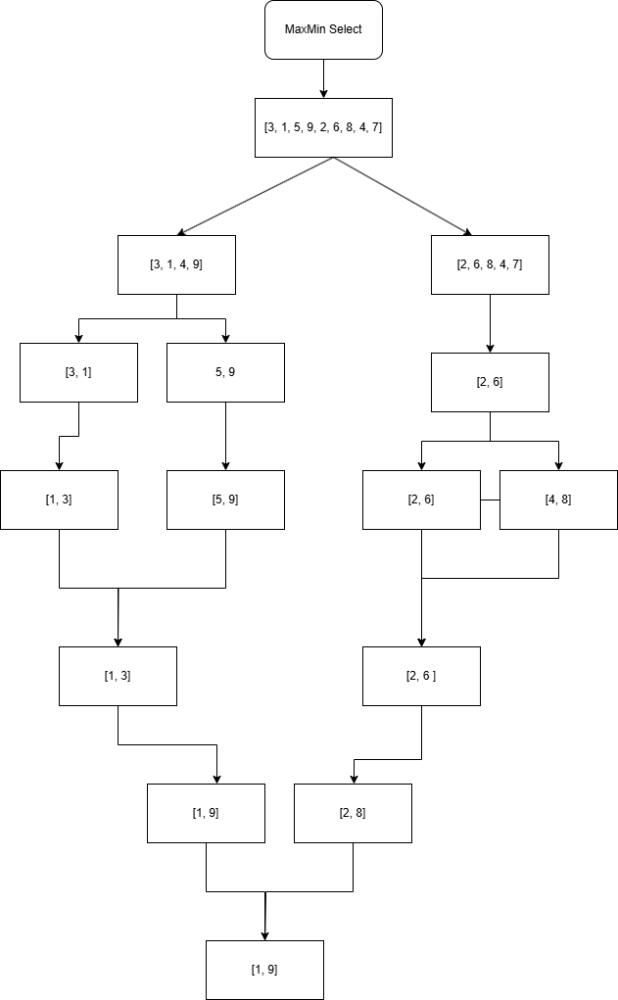

# Implementação do Algoritmo MaxMin Select

Este projeto tem como objetivo implementar, em Python, o algoritmo de seleção simultânea do maior e do menor elemento (MaxMin Select) utilizando a técnica de divisão e conquista. O algoritmo é implementado de forma recursiva e busca reduzir o número de comparações necessárias em relação a outras abordagens.

## Descrição do Projeto

O algoritmo **MaxMin Select** divide a sequência de números em subproblemas menores, resolve cada um deles de forma recursiva e, em seguida, combina os resultados para determinar o elemento máximo e o mínimo da sequência original. 

### Lógica do Algoritmo

1. **Caso Base:**
   - Se o subvetor tiver apenas um elemento, este elemento é tanto o mínimo quanto o máximo.
   - Se o subvetor tiver dois elementos, realiza-se uma única comparação para definir o mínimo e o máximo.

2. **Divisão e Conquista:**
   - Para subvetores com mais de dois elementos, divide-se o vetor ao meio.
   - Aplica-se recursivamente a função em cada metade.
   - Na etapa de combinação, compara-se os mínimos e os máximos obtidos de cada subvetor para definir os resultados finais.

3. **Eficiência:**
   - Essa abordagem reduz o número total de comparações.
   - Em uma análise por contagem de operações, observa-se que o algoritmo realiza aproximadamente (3n/2 - 2) comparações para n elementos.
   - Pela aplicação do Teorema Mestre na recorrência:
     - Recorrência: **T(n) = 2T(n/2) + O(1)**
     - Aqui, **a = 2**, **b = 2** e **f(n) = O(1)**
     - Calculando: log₂(2) = 1
     - Como f(n) é O(1) (inferior a n¹), o algoritmo se enquadra no Caso 1 do Teorema Mestre, resultando em **T(n) = Θ(n)**.

## Como Executar o Projeto

1. **Pré-requisitos:**
   - Certifique-se de ter o Python 3 instalado no seu ambiente local.

2. **Execução:**
   - Clone o repositório.
   - Abra o terminal na pasta do projeto.
   - Execute o comando:
     ```
     python main.py
     ```
   - O programa exibirá os valores mínimo e máximo encontrados na sequência de exemplo.

## Relatório Técnico

### Análise da Complexidade Assintótica pela Contagem de Operações

- **Comparação em casos com dois elementos:** Uma comparação.
- **Combinação dos resultados:** Para cada divisão, são realizadas duas comparações (uma para os mínimos e outra para os máximos).
- **Total de comparações:** Ao processar recursivamente as metades, o número total de comparações aproxima-se de (3n/2 - 2) para n elementos.

### Análise da Complexidade Utilizando o Teorema Mestre

A complexidade assintótica do algoritmo **MaxMin Select** pode ser analisada usando o **Teorema Mestre**, que nos permite determinar a solução de uma recorrência do tipo:

\[
T(n) = aT(n / b) + f(n)
\]

Para o nosso algoritmo, temos a seguinte recorrência:

\[
T(n) = 2T(n / 2) + O(1)
\]

Onde:
- \(a = 2\), pois dividimos o problema em duas partes recursivas.
- \(b = 2\), pois cada subproblema é de tamanho \(n / 2\).
- \(f(n) = O(1)\), pois o trabalho adicional em cada nível de recursão é constante (apenas duas comparações para combinar os resultados).

#### 1. Identificação dos valores \(a\), \(b\) e \(f(n)\)
- \(a = 2\)
- \(b = 2\)
- \(f(n) = O(1)\)

#### 2. Cálculo de \(\log_b(a)\)

Para aplicar o Teorema Mestre, precisamos calcular \(\log_b(a)\). O valor de \(\log_b(a)\) pode ser calculado como:

\[
\log_b(a) = \log_2(2) = 1
\]

#### 3. Comparação com os três casos do Teorema Mestre

Agora, precisamos comparar a função \(f(n)\) com \(n^{\log_b(a)}\), que é \(n^1 = n\). O Teorema Mestre tem três casos:

1. **Caso 1:** Se \(f(n)\) é \(O(n^c)\), onde \(c < \log_b(a)\), a solução da recorrência é \(T(n) = O(n^{\log_b(a)})\).
2. **Caso 2:** Se \(f(n)\) é \(O(n^c)\), onde \(c = \log_b(a)\), a solução da recorrência é \(T(n) = O(n^c \log n)\).
3. **Caso 3:** Se \(f(n)\) é \(O(n^c)\), onde \(c > \log_b(a)\), a solução da recorrência é \(T(n) = O(f(n))\).

Neste caso, temos \(f(n) = O(1)\), e como \(1 < n\), isso se enquadra no **Caso 3** do Teorema Mestre. Portanto, a complexidade assintótica da função é dada por \(T(n) = O(n)\).

#### 4. Solução Assintótica

A partir da análise, concluímos que a solução assintótica da recorrência é:

\[
T(n) = O(n)
\]

Ou seja, o algoritmo **MaxMin Select** possui uma complexidade linear **Θ(n)**, o que é uma grande melhoria em relação a uma abordagem ingênua que exigiria \(O(n)\) comparações para encontrar o mínimo e o máximo separadamente.

### Diagrama Visual

O diagrama abaixo ilustra como o algoritmo **MaxMin Select** divide e combina os subproblemas recursivos, incluindo os níveis da árvore em cada nível.

